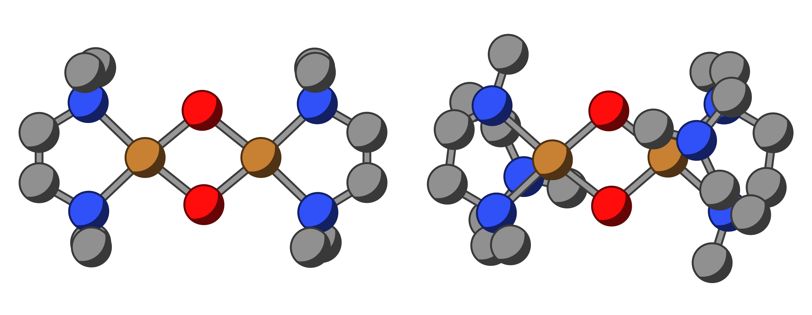
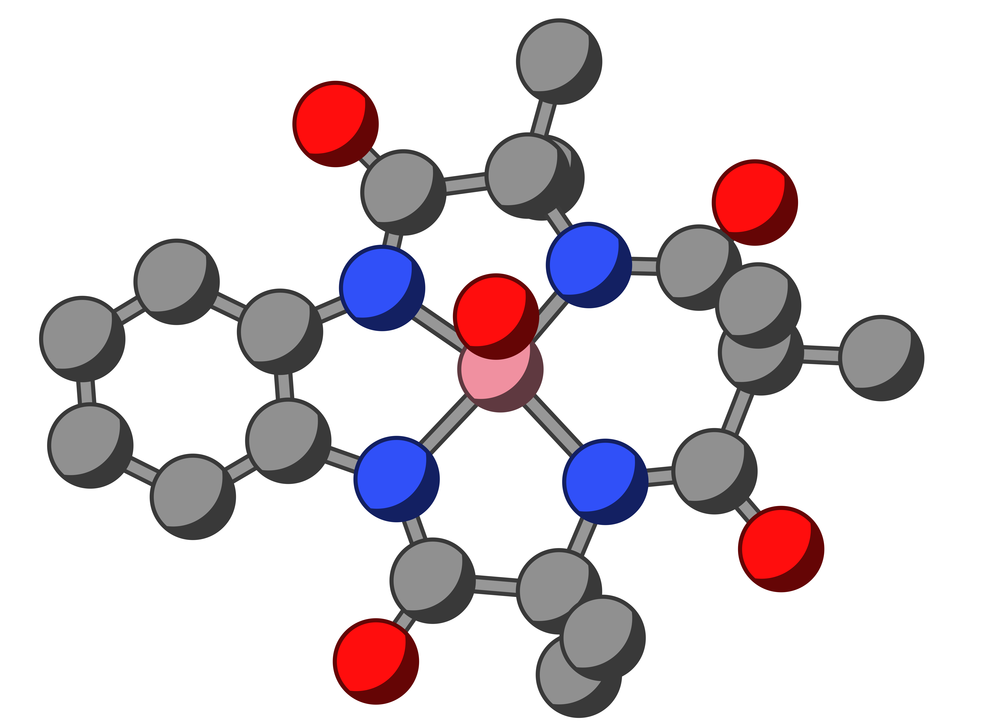
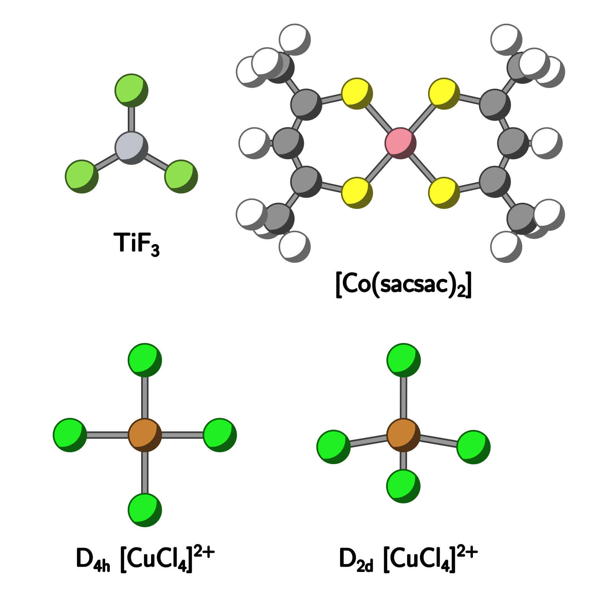
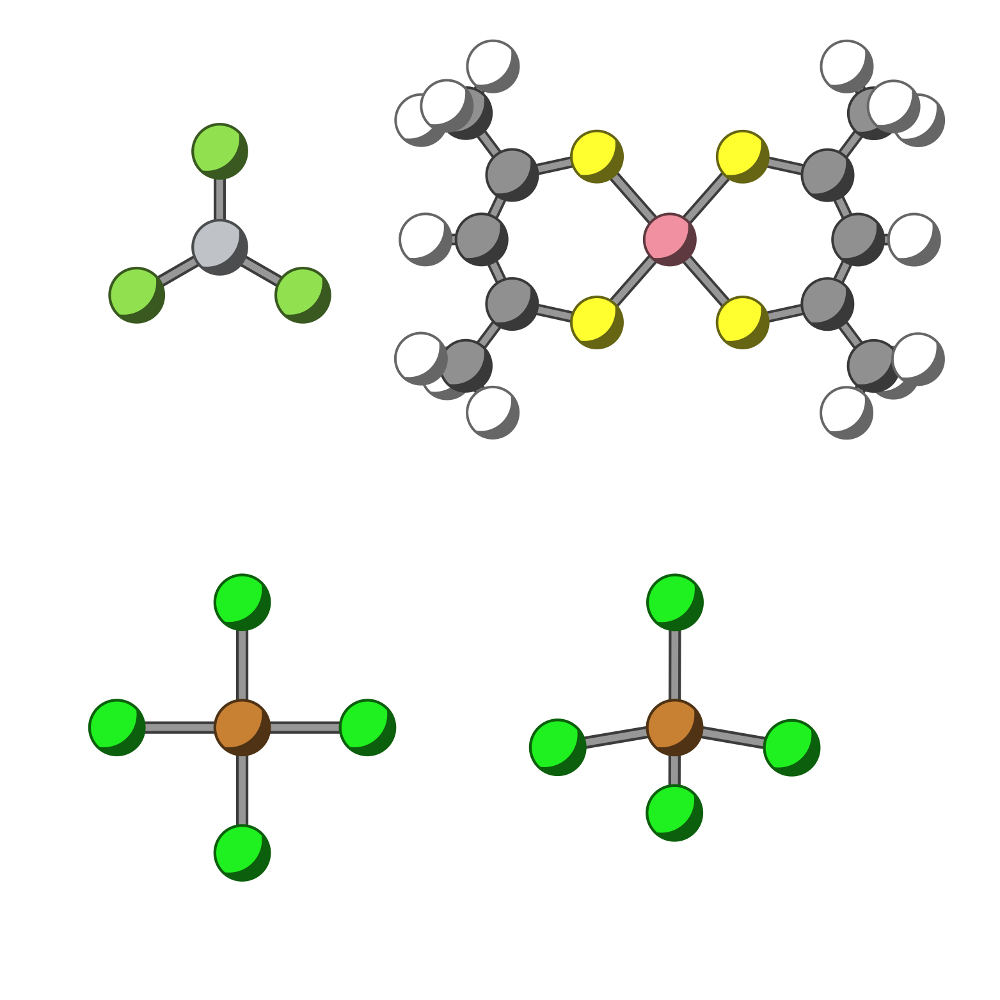

My doctoral thesis, titled "*Ab Initio Insights into Molecular Magnetism: A Multireference Study of Transition Metal Complexes*", focused on using multireference methods to study electronic structure and molecular magnetism in transition metal complexes. A brief summary of my work is provided below.

[ View PhD Thesis Summary](Gurjot_Singh_thesis_summary.pdf){.btn .btn-primary target="_blank"} &nbsp; [ Download](Gurjot_Singh_thesis_summary.pdf){.btn .btn-primary target="_blank" download="Gurjot_Singh_thesis_summary.pdf"}

The full thesis is available online through the university repository.

[ View Full Thesis](https://doi.org/10.18452/37580){.btn .btn-primary target="_blank"}

---

## Multireference Electronic Structure Methods

I applied multireference methods to study challenging transition metal complexes with open-shell configurations, near-degenerate excited states, and strong (static) and dynamic correlation effects.
My work included the use of the following methods:

- **CASSCF and NEVPT2**: Standard tools for treating static and dynamic correlation.
- **QD-NEVPT2**: Accurately treats near-degenerate states.
- **Approximate Full CI solvers**: Handles large active spaces with DMRG or selected CI solvers.

---

## Molecular Magnetism

I investigated magnetic properties of transition metal complexes, including exchange interactions, spin-orbit coupling, and EPR parameters using ab initio methods.

### Exchange Interactions

Studied exchange coupling in copper dimers[^1] (Fig. 1), using the following methods:

- CASSCF/DMRGSCF for static correlation and NEVPT2 for dynamic correlation.
- DDCI method as an alternative for treating dynamic correlation, found to be the most accurate method for Cu dimers.
- A new BS-LPNO-CCSD approach, combining broken-symmetry theory with local coupled-cluster method, as an alternative to the standard BS-DFT.

### Spin-Orbit Coupling and *g*-tensors

Studied electronic structure of a cobalt-oxo intermediate (Fig. 2).[^2]

- Collaborated with experimentalists, where we resolved the ambiguity in the characterization of the intermediate by proposing two interconvertible tautomers.
- Calculated $g$-tensors using CASSCF + NEVPT2 to probe the electronic structure.

{width=50%}

Developed a new framework combining QD-NEVPT2 with selected CI references (based on Ugandi and Roemelt's spin-pure heatbath CI[^3]) for calculating spin-orbit coupling and $g$-tensors.

- Implemented the methodology in the [HUMMR program](https://scm.cms.hu-berlin.de/hummr-dev-team/hummr){target="_blank"}.[^4]
- Tested and validated on benchmark systems (Fig. 3).

{width=80% .light-only}
{width=80% .dark-only}

[^1]: **Singh, G.**; Gamboa, S.; Orio, M.; Pantazis, D. A.; Roemelt, M. Magnetic Exchange Coupling in Cu Dimers Studied with Modern Multireference Methods and Broken-Symmetry Coupled Cluster Theory. *Theor. Chem. Acc.* **2021**, *140* (10). <https://doi.org/10.1007/s00214-021-02830-0>

[^2]: Malik, D. D.; Ryu, W.; Kim, Y.; **Singh, G.**; Kim, J.-H.; Sankaralingam, M.; Lee, Y.-M.; Seo, M. S.; Sundararajan, M.; Ocampo, D.; Roemelt, M.; Park, K.; Kim, S. H.; Baik, M.-H.; Shearer, J.; Ray, K.; Fukuzumi, S.; Nam, W. Identification, Characterization, and Electronic Structures of Interconvertible Cobalt–Oxygen TAML Intermediates. *J. Am. Chem. Soc.* **2024**, *146* (20), 13817–13835. <https://doi.org/10.1021/jacs.3c14346>

[^3]: Ugandi, M.; Roemelt, M. A Configuration-Based Heatbath-CI for Spin-Adapted Multireference Electronic Structure Calculations with Large Active Spaces. *J. Comput. Chem.* **2023**, *44* (31), 2374–2390. <https://doi.org/10.1002/jcc.27203>

[^4]: HUMMR User Guide: [hummr-dev-team.pages.cms.hu-berlin.de](https://hummr-dev-team.pages.cms.hu-berlin.de/hummr/){target="_blank"}
